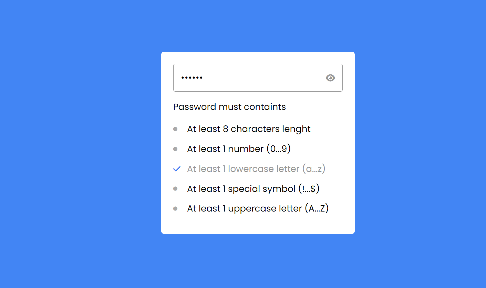

# Create Password

## Índice

- [Descripción del Proyecto](#descripción-del-proyecto)
- [Estado del Proyecto](#estado-del-proyecto)
- [Características Importantes](#características-importantes)
- [Acceso al Proyecto](#acceso-al-proyecto)
- [Tecnologías Utilizadas](#tecnologías-utilizadas)
- [Previa del proyecto](#desarrollado-por)
- [Previa del proyecto](#Previa-del-proyecto)

## Descripción del Proyecto

Este proyecto consiste en una herramienta para crear contraseñas seguras. La aplicación permite al usuario generar contraseñas cumpliendo con una serie de requisitos mínimos, como longitud, uso de caracteres especiales, números, letras mayúsculas y minúsculas, entre otros. Además, la herramienta proporciona retroalimentación en tiempo real al usuario, indicando si los requisitos necesarios se están cumpliendo mientras se crea la contraseña.

## Estado del Proyecto

Terminado.

## Características Importantes

Una característica importante del proyecto es la detección de que se cumplen los requisitos para la creación de la contraseña.

## Acceso al Proyecto

El proyecto está disponible para su prueba en el siguiente enlace: [Enlace al Proyecto](http://www.ejemplo.com)

## Tecnologías Utilizadas

- HTML5
- JavaScript
- CSS

## Desarrollado por

Desarrollado por [Elkin Murillo](http://www.ejemplo.com). Puedes agregar una imagen o enlace adicional aquí.

## Previa del proyecto

